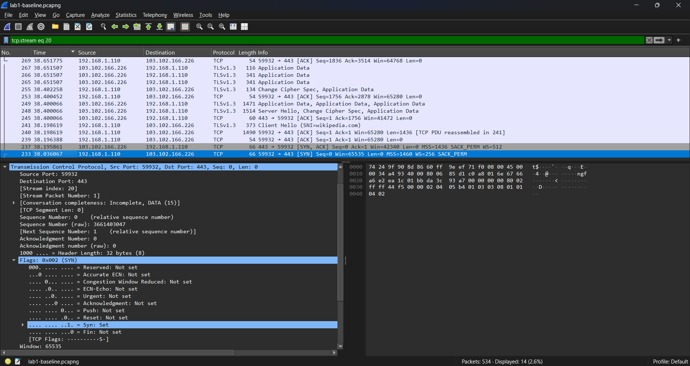
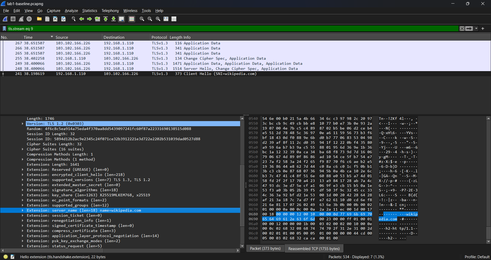
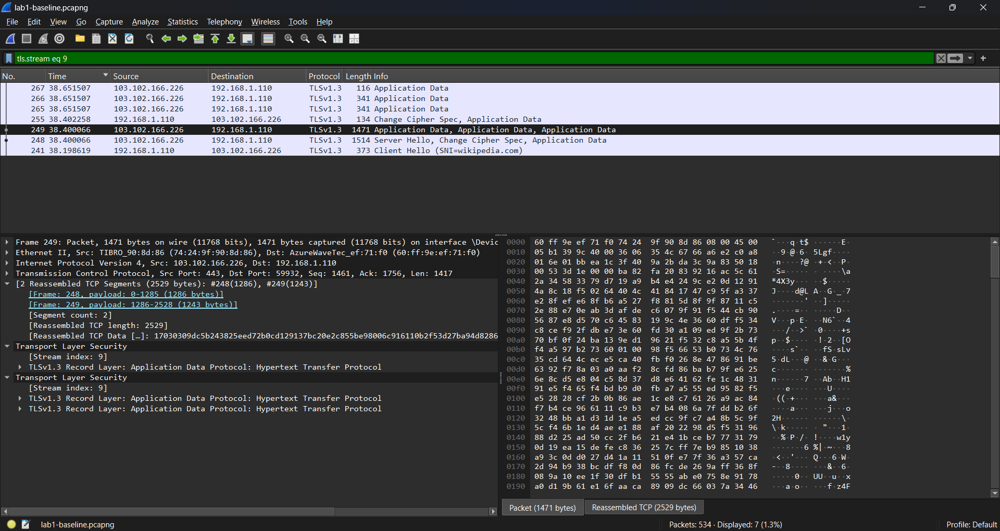

# Lab 1 – Baseline Network Traffic Analysis

## Objective
Capture and analyse normal network traffic to understand how everyday web browsing works at the network level.

## Environment
- Host OS: Windows  
- Tool: Wireshark  
- Network: Home network  

## Activity Performed
- Captured live network traffic using Wireshark  
- Visited example.com and wikipedia.org during the capture  
- Observed DNS resolution, TCP connection setup, and HTTPS (TLS) traffic  

## Key Observations

### DNS Behaviour
- A DNS query for www.wikipedia.org was observed.
- The DNS response matched the query using the same Transaction ID.
- This confirmed that the domain name was successfully resolved.
- DNS resolution occurred before any TCP connection was established, which is expected behaviour.

### TCP Behaviour
- A TCP three-way handshake was observed before HTTPS communication.
- The handshake followed the standard sequence:
  - SYN from the client
  - SYN/ACK from the server
  - ACK from the client
- Completion of this handshake confirmed that a TCP connection was successfully established.

### TLS Behaviour
- After the TCP connection was established, a TLS handshake was observed.
- A TLS Client Hello was sent by the client, including the Server Name Indication (SNI) for wikipedia.org.
- The server responded with a TLS Server Hello, confirming the encrypted session setup.
- Following the handshake, encrypted TLS application data was observed.
- The contents of the HTTPS traffic were not readable, which confirms encryption was in use.

## Evidence

### DNS Resolution
  

### TCP Three-Way Handshake
  
  

### TLS Handshake and Encrypted Traffic
  
  

## Outcome
This lab establishes a basic baseline of normal DNS, TCP, and TLS behaviour during web browsing. Understanding this baseline is important before analysing traffic that may indicate errors, misconfiguration, or suspicious activity.
